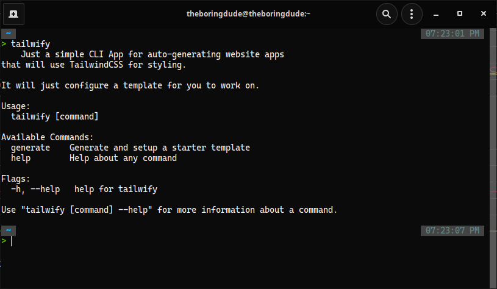

# tailwify
Simple auto-script tool for Auto-generating starter templates with TailwindCSS.

I am a fan of Tailwind but then I am too lazy in configuring it again in another project. So that's why I made this, to ease my life. xD

## Install
```
go get -u github.com/TheBoringDude/tailwify
```

## What it does?
Nothing fancy, just the following, .. 
- Install the specified framework
- Add TailwindCss packages and others
- Configure the framework (modify files / strings)

## Supported and Added Frameworks
- Next.JS (`next`)
- Gatsby (`gatsby`)
- Vue3 w/ Vite (`viteVue3`)
- React (`react`)

## How to Use:
```bash
# framework could be (next/gatsby/viteVue3/react)
# project-name should be in lowercase and kebab or snake-case
# camelCase projectName will be converted to lowercase
tailwify generate {framework} -p {project-name}
```

#### Installations and configurations are based from the official docs: https://tailwindcss.com/docs/installation

### Image


#### &copy; TheBoringDude